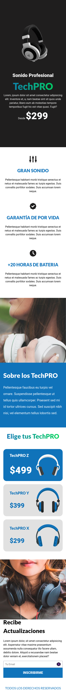
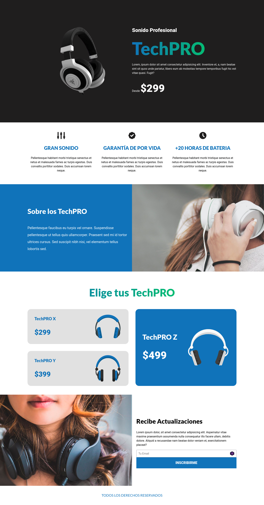

# headset_landingpage
This is a webpage part of the course of CSS La Guía Completa - Flexbox, CSS Grid, SASS +20 proyectos

## Table of contents

- [Overview](#overview)
  - [Screenshot](#screenshot)
  - [Links](#links)
- [My process](#my-process)
  - [Built with](#built-with)
  - [What I learned](#what-i-learned)
  - [Continued development](#continued-development)
  - [Useful resources](#useful-resources)
- [Author](#author)
- [Acknowledgments](#acknowledgments)

## Overview

### Screenshot
# Mobile

# Desktop



### Links

- Gist to detect AVIF and Webp browser support: [Gist](https://gist.github.com/juanpablogdl/3bbdf0f2920cd9c65187128dd1c032cc#file-imagenes-js/)
- Live Site URL: [Link](https://jaac97.github.io/headset_landingpage)


## My process

### Built with

- Semantic HTML5 markup
- CSS custom properties
- Flexbox
- CSS Grid
- Mobile-first workflow
- Object-Oriented CSS


### What I learned

I've learned how to change the growth direction for an element using Position relative and absolute, how to use background-image with two sentences using color and an image


```css
.newsletter {
        background-image: linear-gradient(to right, transparent 50%, var(--white) 50%, var(--white) 100%), url('../img/newsletter.jpg');
    }
```

### Continued development

I have to improve my knowleged about CSS Grid

### Useful resources

- [CSS La Guía Completa - Flexbox, CSS Grid, SASS +20 proyectos](https://www.udemy.com/course/css-grid-y-flexbox-la-guia-definitiva-crea-10-proyectos/) - This course really help me to improve my css knowledge and how to build a website with good practice
- [The Odin Project](https://www.theodinproject.com/)


## Author

- LinkedIn - [Josué Alarcón](https://www.linkedin.com/in/josue-alarcon-camino/)
- Github - [@jaac97](https://github.com/jaac97)
- Frontend Mentor - [@jaac97](https://www.frontendmentor.io/profile/jaac97)


## Acknowledgments

I want to give thanks to Professor Juan de la Torre, I think He's a really good teacher,  I also want to thank The Odin Project to be a awesome and free resource to learn about web development

